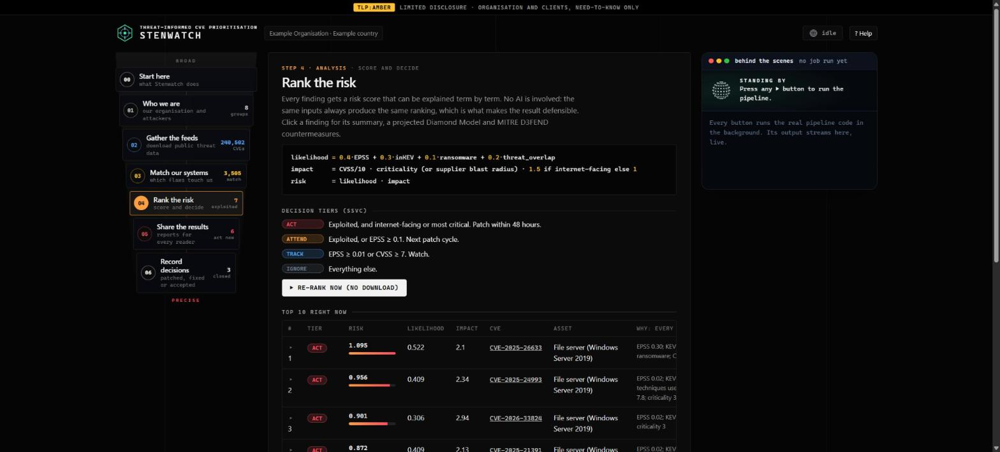
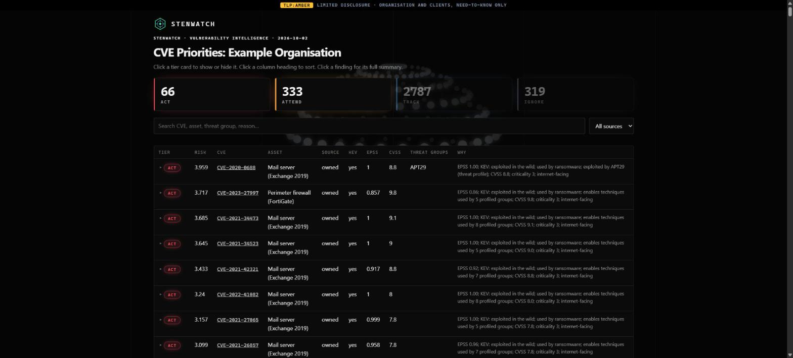
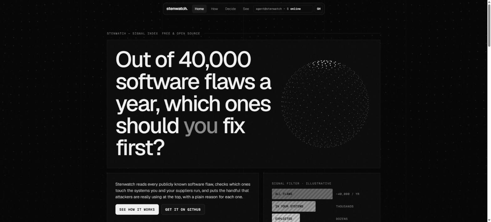

<div align="center">

# Stenwatch

**Threat-informed CVE prioritisation.**
From every CVE in the world to the few that matter to *your* organisation, with a reason for every decision.


</div>

*Stenwatch* is a narrow watch: it watches the whole global vulnerability feed and narrows it to what, in your estate, needs action now, and why.

**[Live page →](https://idiljot-singh.github.io/Stenwatch/)**

## Showcase

A monochrome, terminal-style interface: the console is a funnel that narrows every CVE in the world down to the few that need action, and a dotted "thinking orb" scrambles and clicks back into place while the pipeline works. The landing page adds a particle sphere, scroll reveals and a drifting dot field.



| Analyst dashboard | Public landing page |
|---|---|
|  |  |

<sub>Screenshots use the bundled Example Organisation, not real data.</sub>

## Why

About 40,000 CVEs are published every year. Most teams rank them by CVSS, which measures how bad a flaw *could* be, not whether anyone is using it against *you*. Stenwatch answers three questions instead:

1. **Do we run it?** Owned assets are matched to every CVE by product (CPE) and version.
2. **Do our suppliers run it?** MSPs, SaaS and partners are scored by blast radius: the data they hold and the access they have.
3. **Are the attackers who target us using it?** Known exploitation (CISA KEV), predicted exploitation (FIRST EPSS), and the adversary groups in your threat profile (MITRE ATT&CK + CTID mappings).

The result is a ranked, explainable list in four SSVC decision tiers: **Act** (within 48 h) · **Attend** · **Track** · **Ignore**.

## Features

| | |
|---|---|
| **Full CTI lifecycle** | Direction → Collection → Processing → Analysis → Dissemination → Feedback, one module per stage |
| **Explainable scoring** | `risk = likelihood × impact`. Every term is written out next to each finding, plus a plain-English summary: what it is, how likely it is to be used, by whom, what an attacker gains and what to do; all weights live in one YAML file |
| **Deterministic** | The same inputs give a byte-identical ranking. An optional LLM only writes the management brief and never scores |
| **Defend and model** | Every finding lists MITRE **D3FEND** countermeasures and ATT&CK mitigations for its techniques, and a projected **Diamond Model** (adversary, capability, infrastructure, victim) of the intrusion it would enable |
| **Third-party risk** | Supplier CVEs are weighted by data access and privileged access |
| **Designed outputs** | Analyst dashboard, intelligence report and management brief (styled HTML plus PDF), CSV, and a **STIX 2.1** bundle for MISP, OpenCTI or Sentinel |
| **Console** | A local web interface that walks through each stage, runs the real code and streams its output |
| **Secure by design** | Localhost-only console with CSRF and DNS-rebinding protection, secrets in the OS credential store, hash-pinned dependencies, TLP:AMBER marking, feed-poisoning guards |
| **Small** | About 1,100 lines of plain Python, 4 dependencies, SQLite, no servers |

## Install (Windows beta)

Watch the two short films first if you want the overview: [how it works, step by step](https://idiljot-singh.github.io/Stenwatch/video.html) and why it is threat intelligence rather than a scanner (same page). Both use the bundled Example Organisation.

Download `Stenwatch-Setup-0.1.0-beta.exe` from the Releases page and run it. No admin rights are needed. Windows will show a blue "unknown publisher" screen because the beta is unsigned: choose **More info → Run anyway**, or ask IT to allow-list the file by its SHA-256 (printed next to the download). A short tour opens on first launch. Your data lives in `%APPDATA%\Stenwatch` and survives updates; uninstalling asks whether to delete it. To update, run the newer Setup over the old one.

## Setup from zero (Windows)

Nothing installed, no admin rights, no policy changes:

1. Get the code: **Code → Download ZIP** on GitHub and unzip it (or `git clone https://github.com/idiljot-singh/Stenwatch.git`).
2. Double-click **`start.bat`**.

If Python is missing, `start.bat` downloads a portable copy (SHA-256 checked) into `.python\`. Nothing is installed system-wide, and deleting the folder removes it. Otherwise it uses your Python in a private `.venv`. Either way it installs the 4 hash-pinned dependencies, runs the bundled Example Organisation and opens its dashboard. Once you have a `profile.yaml` (see below), `start.bat` opens the console instead. It never uses PowerShell scripts, so ExecutionPolicy does not get in the way. On Linux/macOS use `python3 -m venv .venv`, `source .venv/bin/activate` and the commands under Quick start.

## Quick start

```bash
pip install --require-hashes -r requirements.txt
python test_pipeline.py                         # offline self-check: prints "ok"
python run.py --example --since 2026-01-01      # try it on the bundled Example Organisation -> out/example/

copy profile.example.yaml profile.yaml          # your organisation and threat profile
copy assets.example.csv assets.csv              # the software you run
copy third_parties.example.csv third_parties.csv   # your suppliers (optional)
copy exceptions.example.csv exceptions.csv      # analyst decisions (optional)
# Linux/macOS: use cp instead of copy

python app.py                                   # console at http://127.0.0.1:8765
```

In the console, open **Collection → Quick sync** to download the feeds, then **Analysis → Re-rank**. On the command line:

```bash
python run.py --since 2026-01-01        # quick: only CVEs changed since a date
python run.py                           # full NVD history the first time, then incremental
python run.py --skip-collect            # re-rank without downloading
python run.py --suggest-cpe exchange    # find the NVD product name for the cpe column
```

## Documentation

| Document | Read it to… |
|---|---|
| [CUSTOMISE.md](CUSTOMISE.md) | Set Stenwatch up for **your** organisation, step by step, with a checklist |
| [WALKTHROUGH.md](WALKTHROUGH.md) ([PDF](WALKTHROUGH.pdf)) | Understand how every stage works and why |
| [SECURITY.md](SECURITY.md) | Report a vulnerability in Stenwatch |

## How it works

| CTI stage | Module | What it does |
|---|---|---|
| Direction | `profile.yaml` | Organisation, Priority Intelligence Requirements, threat groups, weights, tiers |
| Collection | `cti/collect.py` | NVD (every CVE), CISA KEV, FIRST EPSS, MITRE ATT&CK + D3FEND, CTID KEV→ATT&CK into `cve.db` |
| Processing | `cti/process.py` | Owned assets and suppliers → CPE + version matching; optional Microsoft Defender inventory |
| Analysis | `cti/analyse.py` | Risk score, threat-profile overlap, ATT&CK techniques, SSVC tier |
| Dissemination | `cti/disseminate.py` | `report.html`/`.pdf`, `brief.html`/`.pdf`, `report.csv`, `dashboard.html`, STIX 2.1 `bundle.json` (plus the Markdown sources `report.md`, `brief.md`) |
| Feedback | `exceptions.csv` | Patched, mitigated or accepted decisions that expire and come back for review |

```
likelihood = 0.4·EPSS + 0.3·inKEV + 0.1·ransomware + 0.2·threat_overlap
impact     = CVSS/10 · criticality (or supplier blast radius) · 1.5 if internet-facing
risk       = likelihood · impact
```

## Does the ranking work?

A point-in-time backtest rebuilt six 180-day periods from the data that existed on each start day and scored the rankings against what CISA later added to its Known Exploited Vulnerabilities catalogue (257 later-exploited CVEs).

| Queue | Share of all CVEs | Later-exploited CVEs found (95% interval) |
|---|---|---|
| Stenwatch Attend (EPSS 0.1 or above) | 6.1% | 40% (34 to 46%) |
| CVSS 9 and above | 13.0% | 36% (30 to 42%) |

Attend finds about as many exploited CVEs from a queue less than half the size, but the difference in what they find is **not statistically significant** (p = 0.33). At equal queue size the Stenwatch ranking finds more (50% against 36%); in the long tail severity catches up and passes it, and about 62% of CISA's additions concerned CVEs not yet published when each period began, so no ranking could find them early. An earlier figure of about 70% was wrong (incomplete data) and is withdrawn. Read the full method, statistics and limits in the [backtest report](https://idiljot-singh.github.io/Stenwatch/backtest/report.html) ([PDF](https://idiljot-singh.github.io/Stenwatch/backtest/report.pdf), [summary](docs/backtest.md)). Regenerate it with `python tools/backtest.py` then `python tools/backtest_report.py`.

## Architecture diagrams

Four diagrams, generated from the real code: the [code map](https://idiljot-singh.github.io/Stenwatch/diagrams/code-map.html) (modules, size, complexity), [one click, step by step](https://idiljot-singh.github.io/Stenwatch/diagrams/one-click.html) (sequence), [the installed app](https://idiljot-singh.github.io/Stenwatch/diagrams/installed-app.html) (what runs where) and [where the complexity lives](https://idiljot-singh.github.io/Stenwatch/diagrams/complexity.html).

## Your data stays yours

Stenwatch runs entirely on your machine. `profile.yaml`, the asset, supplier and exception lists, the database and all outputs are **git-ignored**: they describe where your organisation is vulnerable. Only public feeds are downloaded; nothing about your estate is sent anywhere unless you enable a cloud LLM for the brief, and even then the input is redacted.

## Author

**Stenwatch** is created and maintained by **Diljot Singh Johal**.

If you use it in research or in your organisation, please cite it (see [CITATION.cff](CITATION.cff)).

## License

[MIT](LICENSE) © 2026 Diljot Singh Johal.
Feed data belongs to its publishers: NIST NVD, CISA, FIRST, MITRE and the Center for Threat-Informed Defense. Check their terms before redistributing it.
